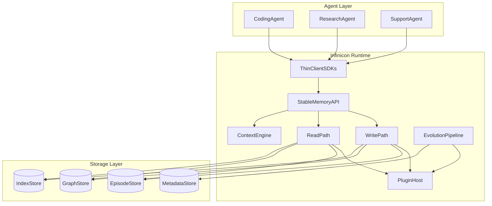
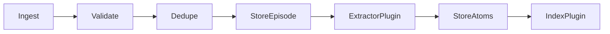
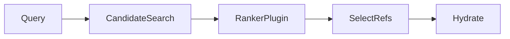
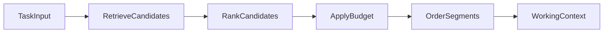

# Architecture Overview

Infinicon is a memory runtime that sits between AI agents and storage systems.

The runtime accepts durable observations, evolves them into useful memory, and assembles bounded working context for future tasks. Its core responsibility is memory semantics: lifecycle, provenance, retrieval, consolidation, deletion, and context assembly.

## Deployment Model

Infinicon uses a hybrid deployment model:

- A normative specification defines the public contract.
- A reference server provides a production-grade implementation.
- Thin client SDKs make integration ergonomic for agent runtimes.
- Future embedded runtimes may implement the same spec locally.

The specification is the product boundary. The reference implementation must prove the spec is usable, but it must not become the only valid implementation.

## Runtime Shape

## Core Paths

### Write Path

The write path turns external observations into durable memory.

The write path must be idempotent because agent systems retry aggressively. A duplicated call with the same dedupe key must not create duplicate durable memory.

### Read Path

The read path retrieves memory references and hydrates them only when needed.

Separating references from hydrated content keeps query responses cheap and allows callers to inspect provenance before pulling full content.

### Context Assembly

Context assembly is the primary agent-facing capability.

The output is structured, not a prompt string. Formatters can translate working context into provider-specific messages later.

### Evolution Pipeline

The evolution pipeline runs asynchronously.

It extracts atoms, creates consolidations, detects contradictions, supersedes stale memories, refreshes indexes, and processes tombstone cascades.

The pipeline may use model-backed plugins, but the runtime does not own model inference. It owns the contract and lifecycle around those calls.

For a concrete mapping of these contracts to the current reference code layout, see [Reference Runtime Skeleton](reference-runtime.md).

## Storage Ports

Infinicon does not define one `StorageBackend` god interface. It defines separate storage ports:

- `EpisodeStore` for append-only raw events.
- `GraphStore` for typed links and provenance.
- `IndexStore` for vector, lexical, or hybrid retrieval indexes.
- `MetadataStore` for scopes, ACLs, jobs, cursors, and runtime state.

A single adapter may implement multiple ports, but the contracts remain separate.

## Plugin Host

Plugins extend behavior without changing the core API.

Initial plugin categories:

- Extractor
- Embedder
- Ranker
- Consolidator
- Formatter
- Storage adapter

The v0 trust model is simple: plugins run in process with the reference server and are trusted code. Sandboxing can be introduced later, but pretending it exists in v0 would be misleading.

## Design Pressure

The architecture must resist becoming an agent framework.

If a feature requires owning tool execution, planning, chat UI, model routing, or application workflow, it belongs outside the core runtime unless a spec-level memory semantic depends on it.
